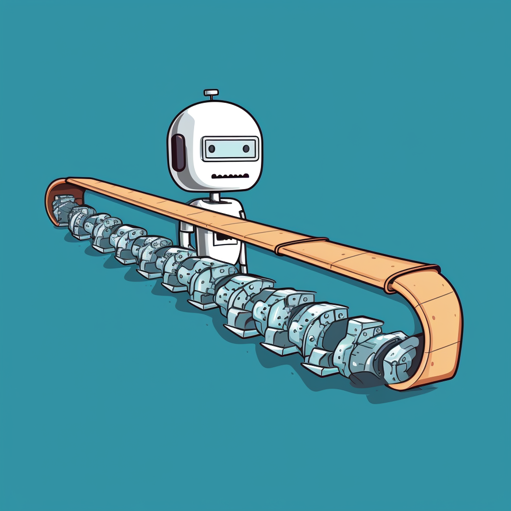

# RobAI Framework Documentation

---



## Introduction
RobAI is a _simple_ but powerful framework designed to make working with AI models more intuitive. It is 'memory' oriented, with a simple flow: it calls all the pre-call functions, it then calls the AI model, then it calls all the post-call functions. 

The common object at every step of the journey is the `memory` object, of type `BaseMemory`. The memory is always available on the robot at `robot.memory`, and you can rely on it being avaiable in all pre-call and post-call functions.

All the robot needs to function are written instructions stored at `memory.instructions_for_ai`. This is _always_  a list of `ChatMessage` objects because whatever you're doing with an AI _language model_, you should be able to create instructions in the form of `[ChatMessage, ChatMessage, ChatMessage]`. Standardizing instructions this way makes things much simpler. 

A robot's 'input' is defined in the memory at memory.input_model. For reasons that will become clear, we shouldn't standardize the input of a robot because it would force developers to pre-process data before it even gets to the robot. The point of robai is that each robot is self contained, so the first function in its pre-call might, for example, parse a SQL query into text.

That's it. When the robot is finished, it returns its memory object. Memory is just a pydantic class where you can store anything the robot might need to 'do' whatever it's tasked with.

## A simple example

```python
class SimpleRobot(AIRobot):
    def __init__(self):
        super().__init__()
        # Look at SimpleChatMemory and you'll see that input_model is ChatMessage.
        # This robot therefore expectes a ChatMessage in process()
        self.memory = SimpleChatMemory(
            purpose="You're a robot that responds to a ChatMessage."
        )
        self.pre_call_chain = [
            self.remember_user_interaction,
            self.create_instructions,
        ]
        self.post_call_chain = [self.stop_the_robot]
        self.ai_model = OpenAIChatCompletion()

    # ==== THE PRE-CALL FUNCTIONS =====
    def remember_user_interaction(self, memory: SimpleChatMemory) -> SimpleChatMemory:
        memory.add_message_to_history(memory.input_model)
        return memory

    def create_instructions(self, memory: SimpleChatMemory) -> SimpleChatMemory:
        memory.instructions_for_ai = [memory.system_prompt, memory.input_model]
        return memory

    """
    ROBOT NOW CALLS AI_MODEL 
    It uses memory.instructions_for_ai as the prompt.
    effectively, it's doing this: 
    robot.ai_model.call(memory.instructions_for_ai)
    Whatever response it gets will be stored as a ChatMessage in the memory here:
    memory.ai_response
    """

    # ==== THE POST-CALL FUNCTIONS =====
    def stop_the_robot(self, memory: SimpleChatMemory) -> SimpleChatMemory:
        # IF we're done, we have to call this or we will loop back to pre-call functions.
        memory.set_complete()
        return memory


if __name__ == "__main__":
    poetry_robot = SimpleRobot()
    some_input = ChatMessage(
        role="user",
        content="I'm a user input. Please write a limerick about an AI framework called Robai [Robe-Aye]",
    )
    memory = poetry_robot.process(some_input)
    our_result = memory.ai_response
    poetry_robot.console.pprint_message(our_result)

```


## A focus on memory
Robots need memory, and they need a `purpose`. As you might have guessed, the purpose of the robot is stored in the robot's memory at `robot.memory.purpose`. It acts as the robot's 'system prompt'. Have a look at the `AIRobot.__init__()` and you'll see that the robot's pupose is added to its own message history as a 'system' message. So the purpose is important. The rest of the memory is there to be useful to you the developer. You'll need to store state, variables, context, whatever you might need, add it to the memory object.

## What about inputs and outputs?
When you call `process()` on the robot, you need to pass an `input_model`, this really can be anything you like. This `input_model` attribute has to be defined on whatever memory you give to the robot. Then you'll know that (its very likely that) the first thing your robot needs to do, in the very first function it calls in the pre-call chain, is to parse that input model and eventually turn it to a set of `memory.instructions_for_ai`. The `memory.input_model` instance is passed into the robot's memory via `robot.process()`. Your robot must then somehow create `memory.instructions_for_ai` as a list of `[ChatMessage]` objects by the end of your pre-call functions. How you do this is entirely up to you.

That's it. 

All you then need to do is call `memory.set_complete()` in postcall the moment your task is done.

## Adding a few more functions

```python
class YourPoetryRobot(AIRobot):
    # Start with the init and fill it in as you go.
    # You'll need: memory, a pre_call_chain, a post_call_chain and an ai_model
    # You need to call super().__init__() so the base AIRobot sets everything up properly.

    # ====== INIT YOUR ROBOT ========
    def __init__(self):
        super().__init__()
        self.memory = SimpleChatMemory(
            purpose="You're a robot that writes poems from the user's input."
        )
        self.pre_call_chain = [
            self.create_log,
            self.remember_user_interaction,
            self.create_instructions,
        ]
        self.post_call_chain = [self.log_what_I_did, self.stop_the_robot]
        self.ai_model = OpenAIChatCompletion()

    # ====== THE PRE-CALL FUNCTIONS  =====
    def create_log(self, memory: SimpleChatMemory) -> SimpleChatMemory:
        self.console.pprint("Here's what was put into robot.process")
        self.console.pprint(message=memory.input_model)
        return memory

    def remember_user_interaction(self, memory: SimpleChatMemory) -> SimpleChatMemory:
        memory.add_message_to_history(memory.input_model)
        return memory

    def create_instructions(self, memory: SimpleChatMemory) -> SimpleChatMemory:
        """
        The line below shows a very simple set of instructions.
        You MUST set memory.instructions_for_ai or the AI won't know what to do!
        The 'system_prompt' is available in memory and it will always be:
            ChatMessage(role='system', content='The Purpose of the Robot')
        It is also added to message_history on init, so you could also get it like this:
        system_prompt = memory.message_history[0]

        So here, our instructions for the AI are the system_prompt message, plus the input_model instance which
        is populated with whatever the user input. Input_models are always ChatMessage objects.
        Instructions_for_ai must always be a list of ChatMessage objects.
        """
        memory.instructions_for_ai = [memory.system_prompt, memory.input_model]

        # It's equivalent to this:
        memory.instructions_for_ai = [
            ChatMessage(role="system", content=self.memory.purpose),
            ChatMessage(
                role="user",
                content="Whatever the user said when the robot was called, like, 'Hey, I heard you're great at writing poems?!",
            ),
        ]
        # But let's set the instructions back to the dynamically created values.
        memory.instructions_for_ai = [memory.system_prompt, memory.input_model]
        return memory

    """
    ROBOT NOW CALLS AI_MODEL USING MEMORY.INSTRUCTIONS_FOR_AI AS THE PROMPT, effectively doing this:
    robot.ai_model.call(memory.instructions_for_ai)
    """

    # ==== THE POST-CALL FUNCTIONS =====
    def log_what_I_did(self, memory: SimpleChatMemory) -> SimpleChatMemory:
        self.console.print("[white]My instructions were:")
        self.console.pprint(memory.instructions_for_ai)
        self.console.print("[white]The AI responded with:")
        self.console.pprint(memory.ai_response)
        self.console.print("[white]Here is the AI's full memory")
        self.console.pprint(memory)
        return memory

    def stop_the_robot(self, memory: SimpleChatMemory) -> SimpleChatMemory:
        # In our case, we don't want to do much else in post_call, so we just stop the process
        # We do this by calling memory.set_complete()
        # WITHOUT THIS THE ROBOT WILL NEVER STOP!
        memory.set_complete()
        return memory


if __name__ == "__main__":
    poetry_robot = YourPoetryRobot()
    some_input_might_be = ChatMessage(
        role="user",
        content="I'm a user input. I heard that no matter what I say, you'll write a poem about it?",
    )
    result = poetry_robot.process(some_input_might_be)

```

## Why?
The framework has been written so that writing code for large *language* models feel closer to writing *language*. Writing AI code should feel intuitive, it should be rooted in concepts familiar to humans, and the code should read like a 'real' interaction. For things to feel familiar, we have to know exactly what happens when we call process on our robot at `robot.process(some_input_string_or_model)`. Also, by standardising the instructions to be a list of ChatMessage objects, chaining together robots becomes trivial, and there are some examples of that in the examples folder. You can place another robot and call its process() function in pre-call or post-call, and you now have chained together robots that are each working until their task is complete.

## What exactly happens when you call the robot?

When you've finished making your robot, you'll call .process() on the robot and this is _exactly_ what will happen.
1. Developer calls `robot.process(input)`
2. `input` is added to the robot's `memory` object at `robot.memory.input_model`
3. `memory` is passed from function to function in the `pre_call_chain`
4. `memory` is then sent to `robot.ai_model` which parses the `robot.memory.instructions_for_ai` attribute, which is always a list of `ChatMessage(role='foo' content='this is basically the prompt)` objects. 
5. `robot.ai_model` then sends those parsed instructions to the AI model, and puts the response in `memory.ai_response`
6. Robot passes the `memory` object (with a new `ai_response`) to every function in `post_call_chain`
6. Robot returns the `memory` object
    - If `memory.set_complete()` is called somewhere in the chain (usually post-call), the `memory` object is returned
    - If `memory` is NOT complete, the `memory` is passed from `post_call_chain` to `pre_call_chain` again and it keeps going until something triggers `memory.set_complete()` in the chain.

As simple as this is, it's actually a very powerful and flexible setup. Robots can easily be chained together in the pre-call and post-call chains because you can rely on the fact that `memory.instructions_for_ai` will *always* be `List[ChatMessage]`. Whatever you're doing with a large language model, you can certainly 'do it' via the medium of ChatMessage objects. Standardising this drastically reduces complexity.

When developing with Robai, you only need to use the `pre-call` functions to create the `memory.instructions_for_ai` for the AI model at step 4. In the `post-call` functions, you can chain the robot to another robot, process the response further, or even send the robot back to `pre-call` if the AI response is not as expected. You really can do whatever you like as long as you stop the robot at some point in post-call, and in pre-call you create a set of instructions. Just call `memory.set_complete()` and the robot will return the entire memory object. 

# A more involved example
### Summarising text
One of the most straight forward use cases for a call to a large language model is to summarize text. But language models have a limit on their context window, which is how much they can 'read' in a single go. Since the context window has to have room for both 'the text' the AI is reading *and* the response they'll generate, you can't just throw text at a language model and hope it works.

Because of the restricted context window (around 16,000 words), to summarise something *longer* than that requires multiple calls to the language model. You would need to split the text into managable chunks, then sequentially show the split text to the language model, with a little reminder of where the AI is up to at each 'step' in the process. You would need to store each response from the language model somewhere and then combine everything together at the end.

It's the sort of task that robai can help you to write in a very intuitive way. It's good to start your robot with the memory module - even if you're not sure what the Robot might need before you get started. Having it at the top of the module can help you conceptualise what's happening, and you can quickly add things to memory when it becomes clear your robot will need it.

```python
from robai.memory import BaseMemory
from robai.base import AIRobot

### MEMORY OBJECT ###
    # Memory must an input_model defined, which is what is passed to the robot
    # When `robot.process(input_model)` is called.
    # We then define on the memory everything we need to complete our task.

class SummaryRobotMemory(BaseMemory):
    input_model: str = None
    chunks: List[str] = []
    # The context window for gpt3.5 is now 16,000 tokens. Each chunk must be less than that.
    # Assumes the model will summarise 10,000 tokens to 6,000 tokens.
    chunk_length_limit: int = 10000
    summaries: List[str] = []
    current_chunk_index: int = 0
    total_chunks: int = 0
    # This is actually inherited from BaseMemory, but seeing it here helps.
    instructions_for_ai: List[ChatMessage] = None

### THE ROBOT ITSELF  ###
class SummaryRobot(AIRobot):
    def __init__(self):
        super().__init__()
        self.ai_model: OpenAIChatCompletion = OpenAIChatCompletion()
        self.memory: SummaryRobotMemory = SummaryRobotMemory(
            purpose="""
                    Please extract all key facts of the text you recieve from a user, and please put it into a format similar to shorthand but human readable.
                   """.strip(
                "\n"
            ),
        )
        # Now we add all the functions we need to pre-call
        self.pre_call_chain: List[Callable] = [
            self.split_text_into_chunks,
            self.provide_context_for_chunk,
        ]
        # And add all the functions we need to post-cal
        self.post_call_chain: List[Callable] = [
            self.append_summary_and_check_complete,
        ]
    """
    PRE CALL FUNCTIONS
    """
    # PRE-CALL 1
    def split_text_into_chunks(
        self,
        memory: SummaryRobotMemory,
    ) -> SummaryRobotMemory:
        # Everything is focused on the memory. Our 'input' will always be stored at memory.input_model
        to_summarise = memory.input_model
        chunk_length_limit = memory.chunk_length_limit
        if not memory.chunks:
            chunks = self.split_text_into_token_chunks(to_summarise, chunk_length_limit)
            memory.chunks = chunks
            memory.current_chunk_index = 0
            memory.total_chunks = len(chunks)
        # Great! Our memory now has memory.chunks populated.
        return memory

    # PRE-CALL 2
    def provide_context_for_chunk(
        self,
        memory: SummaryRobotMemory,
    ) -> SummaryRobotMemory:
        # Pop the first chunk as the current content
        to_summarize = memory.chunks.pop(0)
        current_chunk_num = memory.current_chunk_index + 1
        context = f"""
        You are summarising text. You are at section {current_chunk_num} of {memory.total_chunks}. \n\n
        Here's what you've summarised so far {memory.summaries}\n\n
        You must now summarise this chunk of text and we'll add it to the summary so far: {to_summarize}\n\n
        """
        # the instructions for the AI model are always in the form of ChatMessages.
        memory.instructions_for_ai = [ChatMessage(role="user", content=context)]
        return memory

    
    ### CALL THE AI MODEL
    
    ### THE ROBOT PASSES MEMORY TO THE AI_MODEL AT `robot.ai_model.call(memory)`

    ### GET AND STORE RESPONSE AT robot.memory.ai_response

    """
    POST CALL FUNCTIONS
    """
    # POST-CALL 1
    def append_summary_and_check_complete(
        self,
        memory: SummaryRobotMemory,
    ) -> SummaryRobotMemory:
        # APPEND THE SUMMARY WE HAVE RECEIVED TO THE LIST OF SUMMARIES
        memory.summaries.append(memory.ai_response.content)
        memory.current_chunk_index += 1
        # CHECK IF WE ARE DONE
        if memory.current_chunk_index == memory.total_chunks:
            # There are no more chunks to summarise,
            # we are done. memory.set_complete() means the robot will not go back to pre-call.
            memory.set_complete()
        else:
            # There are more chunks to summarise. We are not done.
            # The robot sends everything back to pre-call and
            # we'll summarise the next chunk.
            # Note that in pre-call we pop() the chunks, so when they're processed they are gone.
            pass

        return memory

    # UTILITY
    def split_text_into_token_chunks(
        self, text: str, chunk_length_limit: int
    ) -> List[str]:
        """
        Split the text into chunks based on an estimated token count.
        """
        average_tokens_per_word = 1.5
        words = text.split()
        words_per_chunk = int(chunk_length_limit / average_tokens_per_word)

        chunks = []
        for i in range(0, len(words), words_per_chunk):
            chunks.append(" ".join(words[i : i + words_per_chunk]))

        return chunks


text_to_summarise = """Some really long text that just goes on and on and on."""
input_model: str = text_to_summarise
memory = robot.process(input_model)
robot.console.print(memory.ai_response)

```

## Examples

The best way to learn about this framework is to look at the examples. The examples use OpenAI and they'll need an environment variable set for your API key. If you read through the examples you'll find additional functionality including ways for the robots to 'call' each other by default.

```python
# Running an example - be sure to have OPENAI_API_KEY environment variable set. See robai.languagemodels.openaicompletion.
python -m robai.examples.debate_bots
```

## Creating new ai_models
Have a look at the languagemodels.py for the base class. Subclassing is simple, you'll just need to handle the call() function in your new ai_model class. All this function needs to do is take a BaseMemory objects as its argument. You can expect that this memory object will have memory.insructions_for_ai inside of it, which will be a list of ChatMessages. In any way that makes sense for that language model, parse those messages to either a string, or whatever is required, pass it to the ai language model, then store the results you get back as a ChatMessage object in the memory at memory.ai_response. Have a look in the code for examples.

### Installation
Installation Instructions:
1. Using pip:
For users who prefer pip, they can install your package directly from GitHub (once you push your changes) with:

```
pip install git+https://github.com/philmade/robai.git
```


2. Using poetry:

```
git clone https://github.com/philmade/robai.git
cd robai
poetry install
```